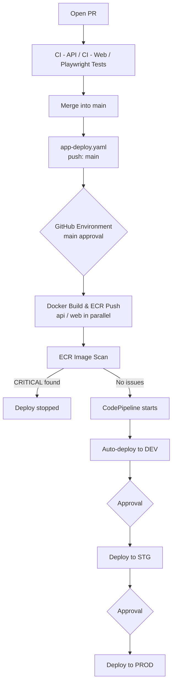
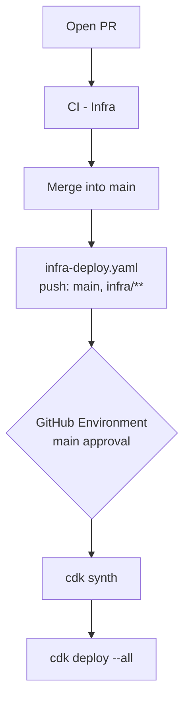

# Deploy

## Account layout

DEV, STG, and PROD are each deployed to a separate AWS account (see "Account layout" in [infra-architecture.md](./infra-architecture.md) for details). The CI/CD pipeline and ECR live together in the "Pipeline account," and STG/PROD (and DEV, if the Pipeline is split out) are deployed to cross-account. By default the Pipeline account is the same as the DEV account and needs no extra setup. `cdk synth`/`cdk deploy` always run with the Pipeline account's credentials (by default, the DEV account's credentials — the ID is read automatically by the CDK CLI from the credentials, so no explicit value is needed).

## Initial setup (first deploy to an AWS account)

You can start with DEV and add STG/PROD incrementally.

```bash
# 1. Log in via AWS SSO (DEV account)
make aws-login

# 2. CDK bootstrap (first time only)
make cdk-bootstrap

# 3. Deploy ECR, DEV infrastructure, and the pipeline
#    POSTGRES_DB (already set in .devcontainer/.env) is used as the RDS database name
#    The JWT secret (dev/jwt-secret) is auto-created by CDK
cd infra
pnpm exec cdk deploy --all \
  -c githubOrg=<your GitHub username or organization> \
  -c githubRepo=<repository name>

# 4. Set the JWT secret's value
#    CDK creates the secret with a random value, so update it to the value you'll actually use
aws secretsmanager put-secret-value \
  --secret-id dev/jwt-secret \
  --secret-string "$(openssl rand -base64 32)"

# 5. Set up GitHub Actions secrets/variables and the GitHub Environment
#    See "Prerequisites (GitHub / AWS setup)" below for what's needed

# 6. Enable the app deploy workflows
#    After the CDK deploy completes, open a PR to move the workflows into workflows/
#    (main is branch-protected, so direct pushes aren't allowed)
git checkout -b enable-deployment-workflows
mv .github/disabled-workflows/app-deploy.yaml .github/workflows/app-deploy.yaml
mv .github/disabled-workflows/infra-deploy.yaml .github/workflows/infra-deploy.yaml
git add .github/workflows
git commit -m "ci: enable deployment workflows"
git push -u origin enable-deployment-workflows
# Open a PR on GitHub and merge it into main

# 7. Pushing to main triggers GitHub Actions to auto-deploy to DEV
```

### Adding a STG environment

Since STG is deployed to a separate AWS account, you need to provision that account beforehand and set up trust from the DEV account.

```bash
# 0. After creating the STG account, run CDK bootstrap with its credentials
#    (to let the DEV account's cdk deploy/pipeline be trusted)
cdk bootstrap aws://<STG account ID>/<region> --trust <DEV account ID>

# 1. Switch back to the DEV account's credentials, set STG_ACCOUNT_ID, and redeploy
#    (stg/jwt-secret is auto-created by CDK)
cd infra
STG_ACCOUNT_ID=<STG account ID> pnpm exec cdk deploy --all \
  -c githubOrg=<your GitHub username or organization> \
  -c githubRepo=<repository name>
```

After deploying, the next push to main adds an STG approval/promotion stage to the CodePipeline. `STG_ACCOUNT_ID` needs to keep being set for every future deploy (including CI) — either set it in `.env` or register it as a CI-side environment variable.

### Adding a PROD environment

Provision a separate AWS account for PROD in the same way.

```bash
# 0. Run CDK bootstrap with the PROD account's credentials
cdk bootstrap aws://<PROD account ID>/<region> --trust <DEV account ID>

# 1. Switch back to the DEV account's credentials, set STG_ACCOUNT_ID/PROD_ACCOUNT_ID, and redeploy
#    (prod/jwt-secret is auto-created by CDK)
cd infra
STG_ACCOUNT_ID=<STG account ID> PROD_ACCOUNT_ID=<PROD account ID> pnpm exec cdk deploy --all \
  -c githubOrg=<your GitHub username or organization> \
  -c githubRepo=<repository name>
```

### Splitting out the Pipeline account (optional)

By default, the Pipeline (CodePipeline, ECR) is co-located with the DEV account. To split it out into a dedicated Tooling/CI-CD account, set `PIPELINE_ACCOUNT_ID`. In this case, DEV also becomes a cross-account deploy target from the Pipeline, just like STG/PROD.

```bash
# 0. After creating the Pipeline account, run CDK bootstrap with its credentials
#    (--trust should be the ID of the account you've been running cdk with so far, i.e. the current DEV account)
cdk bootstrap aws://<Pipeline account ID>/<region> --trust <current DEV account ID>

# 1. Staying on the DEV account's credentials, set PIPELINE_ACCOUNT_ID and redeploy
#    (the Pipeline/ECR go to the Pipeline account; CodeDeploy/the migration CodeBuild etc.
#    are created in the DEV account as a DevDeployTargetStack)
cd infra
PIPELINE_ACCOUNT_ID=<Pipeline account ID> pnpm exec cdk deploy --all \
  -c githubOrg=<your GitHub username or organization> \
  -c githubRepo=<repository name>
```

`PIPELINE_ACCOUNT_ID` needs to keep being set for every future deploy (including CI). The OIDC roles GitHub Actions uses (`github-actions-app-deploy`/`github-actions-infra-deploy`) are also created in the Pipeline account, so the GitHub Secrets values need to be updated to the role ARNs in the Pipeline account.

---

## Prerequisites (GitHub / AWS setup)

Before enabling `app-deploy.yaml`/`infra-deploy.yaml`, all of the following must be set up. In particular, **forgetting the GitHub Environment setup results in unattended deploys with no approval** — be careful.

### 1. GitHub Environment: `main`

Settings → Environments → New environment → `main`

| Setting | Value | Requirement |
|---|---|---|
| Required reviewers | Specify the approvers | Required (without this, the approval gate doesn't function, and a deploy happens unattended the moment something is pushed) |
| Deployment branches | `main` only | Recommended |

Both `app-deploy.yaml` (the `approve` job) and `infra-deploy.yaml` (the `cdk-deploy` job) reference this Environment. The IAM role's trust policy is also scoped to this Environment name, so skipping this setup disables both the GitHub-side and AWS-side safeguards.

### 2. GitHub Secrets

Settings → Secrets and variables → Actions → Secrets

| Name | Workflow | Description |
|---|---|---|
| `AWS_APP_DEPLOY_ROLE_ARN` | `app-deploy.yaml` | OIDC role ARN (only for DEV ECR push, no ECS/CodePipeline access) |
| `AWS_INFRA_DEPLOY_ROLE_ARN` | `infra-deploy.yaml` | OIDC role ARN (for CDK deploy) |
| `E2E_USERNAME` / `E2E_PASSWORD` | `e2e.yaml` | Account used for E2E tests (required; see [ci.md](./ci.md) for details) |
| `JWT_SECRET` / `AUTH_SECRET` | `e2e.yaml` | Optional. A fixed value in the workflow is used if unset |
| `PIPELINE_ACCOUNT_ID` | `infra-deploy.yaml` | Optional. Only set if the Pipeline account has been split out (see [Splitting out the Pipeline account](#splitting-out-the-pipeline-account-optional)) |
| `STG_ACCOUNT_ID` | `infra-deploy.yaml` | Optional. Only set if the STG environment has been added (see [Adding a STG environment](#adding-a-stg-environment)) |
| `PROD_ACCOUNT_ID` | `infra-deploy.yaml` | Optional. Only set if the PROD environment has been added (see [Adding a PROD environment](#adding-a-prod-environment)) |

The above two OIDC roles are **created by CDK (`PipelineStack`) itself**. Run `cdk deploy --all` once locally with strongly-privileged AWS credentials, and set the output role ARNs here (see [README.md](../README.md) for the full initial setup steps).

### 3. GitHub Variables

Settings → Secrets and variables → Actions → Variables

| Name | Workflow | Description |
|---|---|---|
| `AWS_REGION` | All workflows | e.g. `ap-northeast-1` |
| `POSTGRES_DB` | `infra-deploy.yaml` | RDS database name (required for `cdk synth`/`deploy`; unset causes an error) |
| `PROJECT_NAME` | `app-deploy.yaml` | Prefix for the ECR repository name (must match the name generated by `infra/lib/pipeline-naming.ts`; set it to the same value as `name` in the root `package.json`) |

> `PIPELINE_ACCOUNT_ID` / `STG_ACCOUNT_ID` / `PROD_ACCOUNT_ID` are AWS account IDs, so they go under "GitHub Secrets" above, not Variables.

### 4. Branch protection rules (`main`)

Settings → Branches → Branch protection rules

| Setting | Value |
|---|---|
| Require status checks to pass before merging | Require `CI - API` / `CI - Web` / `CI - Infra`, etc. |
| Require a pull request before merging | Recommended (prevents direct pushes to `main`) |

Because `app-deploy.yaml` doesn't itself verify that CI passed, this setting is what actually enforces it.

---

## App deploy flow



`app-deploy.yaml` and `infra-deploy.yaml` share a `concurrency` group (`infra-app-deploy-lock`) — while one is running, the other waits (this prevents the inconsistency that could arise from a CDK infra update running at the same time as an app build/ECS Blue/Green deploy).

---

## Infra deploy flow



---

## App deploy (`.github/workflows/app-deploy.yaml`)

### Overview

Workflow triggered on push to `main` (i.e. a PR merge) when there are changes to `apps/api/**`, `apps/web/**`, `packages/**`, or `pnpm-lock.yaml`. With branch protection rules guaranteeing CI has already passed, it builds Docker images and pushes them to the DEV environment's ECR. The push triggers the CodePipeline, which starts the DEV→STG→PROD promotion pipeline.

The CI-passed guarantee is enforced not within the workflow itself but by GitHub's **Required status checks** (branch protection rules). It shares a `concurrency` group (`infra-app-deploy-lock`) with `infra-deploy.yaml` and waits, without being canceled, while a CDK infra update is in progress.

### ECR push and the scan gate

- Pushes two tags: `:${GITHUB_SHA}` and `:latest`
- Because `imageScanOnPush: true`, a scan runs immediately after the push
- If even one `CRITICAL` vulnerability is found, the workflow fails and the pipeline doesn't start

### Required GitHub Secrets / Variables

| Name | Type | Description |
|---|---|---|
| `AWS_APP_DEPLOY_ROLE_ARN` | Secret | OIDC role ARN (only for ECR push, no ECS/CodePipeline access) |
| `AWS_REGION` | Variable | AWS region (e.g. `ap-northeast-1`) |

---

## Infra deploy (`.github/workflows/infra-deploy.yaml`)

### Overview

Workflow triggered on push to `main` (i.e. a PR merge) when there are changes to `infra/**`. After passing through the GitHub Environment (`main`) approval gate, it authenticates to AWS via OIDC and automatically deploys the CDK stacks. It shares a `concurrency` group (`infra-app-deploy-lock`) with `app-deploy.yaml` and waits, without being canceled, while an app build/deploy is in progress.

By standardizing on GitHub Actions + OIDC instead of CodePipeline + CodeStar Connections, all of CI/CD is managed as code with no manual setup required.

### Approval gate

Setting the following on the GitHub Environment `main` enforces manual approval before deploying and restricts which branch can trigger it.

| Setting | Value |
|---|---|
| Required reviewers | Specify the approvers |
| Deployment branches | `main` only |

### OIDC trust policy

Tying the IAM role's trust policy to the Environment (`main`) blocks any Assume that doesn't go through this Environment, on the AWS side as well.

```json
"StringEquals": {
  "token.actions.githubusercontent.com:sub": "repo:<org>/<repo>:environment:main"
}
```

### Required GitHub Secrets / Variables

| Name | Type | Description |
|---|---|---|
| `AWS_INFRA_DEPLOY_ROLE_ARN` | Secret | OIDC role ARN (for CDK deploy) |
| `AWS_REGION` | Variable | AWS region |
| `POSTGRES_DB` | Variable | RDS database name |
| `PIPELINE_ACCOUNT_ID` | Secret | Optional. Only set if the Pipeline account has been split out (see [Splitting out the Pipeline account](#splitting-out-the-pipeline-account-optional)) |
| `STG_ACCOUNT_ID` | Secret | Optional. Only set if the STG environment has been added (see [Adding a STG environment](#adding-a-stg-environment)) |
| `PROD_ACCOUNT_ID` | Secret | Optional. Only set if the PROD environment has been added (see [Adding a PROD environment](#adding-a-prod-environment)) |

---

## Manual app deploy steps

Steps for deploying the app manually — right after a CDK deploy, or without going through the GitHub Actions workflows.

### Prerequisites

- AWS CLI installed and configured
- Docker installed and running
- AWS credentials configured with the following IAM permissions
  - `ecr:GetAuthorizationToken`
  - `ecr:BatchCheckLayerAvailability`, `ecr:InitiateLayerUpload`, `ecr:UploadLayerPart`, `ecr:CompleteLayerUpload`, `ecr:PutImage` (for the `forge-ts/api-dev` / `forge-ts/web-dev` repositories)
  - `ecr:DescribeImageScanFindings`, `ecr:DescribeImages` (for checking scan results)

### 1. Set environment variables

Copy `.env.example`, fill in the values, then load it.

```bash
cp .env.example .env
# Edit .env and set AWS_REGION, AWS_ACCOUNT_ID, IMAGE_TAG
set -a && source .env && set +a
```

Assemble `REGISTRY` dynamically in the shell.

```bash
export REGISTRY=$AWS_ACCOUNT_ID.dkr.ecr.$AWS_REGION.amazonaws.com
```

### 2. Log in to ECR

```bash
aws ecr get-login-password --region $AWS_REGION | \
  docker login --username AWS --password-stdin $REGISTRY
```

### 3. Build & push the API image

The build context is the monorepo root (see `apps/api/Dockerfile`).

```bash
docker build \
  --platform linux/arm64 \
  -t $REGISTRY/forge-ts/api-dev:$IMAGE_TAG \
  -f apps/api/Dockerfile \
  .

docker push $REGISTRY/forge-ts/api-dev:$IMAGE_TAG
```

### 4. Build & push the Web image

```bash
docker build \
  --platform linux/arm64 \
  -t $REGISTRY/forge-ts/web-dev:$IMAGE_TAG \
  -f apps/web/Dockerfile \
  .

docker push $REGISTRY/forge-ts/web-dev:$IMAGE_TAG
```

### 5. Check the ECR scan results

If a CRITICAL vulnerability is found, don't push the `:latest` tag — fix the vulnerability and rebuild first.

```bash
for REPO in forge-ts/api-dev forge-ts/web-dev; do
  echo "=== $REPO ==="
  aws ecr wait image-scan-complete \
    --repository-name "$REPO" \
    --image-id "imageTag=$IMAGE_TAG" \
    --region "$AWS_REGION"

  aws ecr describe-image-scan-findings \
    --repository-name "$REPO" \
    --image-id "imageTag=$IMAGE_TAG" \
    --region "$AWS_REGION" \
    --query 'imageScanFindings.findingSeverityCounts' \
    --output table
done
```

### 6. Push the `:latest` tag (triggers CodePipeline)

Once you've confirmed there are no CRITICAL vulnerabilities, push the `:latest` tag. This push triggers `ApiAppPipeline`/`WebAppPipeline` via EventBridge.

```bash
# API
docker tag $REGISTRY/forge-ts/api-dev:$IMAGE_TAG $REGISTRY/forge-ts/api-dev:latest
docker push $REGISTRY/forge-ts/api-dev:latest

# Web
docker tag $REGISTRY/forge-ts/web-dev:$IMAGE_TAG $REGISTRY/forge-ts/web-dev:latest
docker push $REGISTRY/forge-ts/web-dev:latest
```

## App pipeline (CodePipeline: `ApiAppPipeline` / `WebAppPipeline`)

### Overview

A pipeline that starts when it detects an ECR `:latest` tag update via EventBridge (placed in the Pipeline account; co-located with DEV by default). After auto-deploying to DEV, it promotes the image to STG and PROD in turn through approvals. Execution (deploy, migration) for STG/PROD (and DEV, if the Pipeline is split out) is a cross-account action from the Pipeline account (see `PipelineStack`/`DeployTargetStack` in [infra-architecture.md](./infra-architecture.md) for details).

### Promotion model

```
ECR forge-ts/api-dev:latest push (always to a repository in the Pipeline account)
  └─ Auto-deploy to DEV (Blue/Green, LINEAR_10PERCENT_EVERY_1MINUTES)
       └─ Approval (if STG_ACCOUNT_ID is set)
            └─ Promote to forge-ts/api-stg:latest (same image digest, completes within the Pipeline account)
                 └─ Cross-account deploy to the STG account
                      └─ Approval (if PROD_ACCOUNT_ID is set)
                           └─ Promote to forge-ts/api-prod:latest
                                └─ Cross-account deploy to the PROD account
```

Promotion copies the manifest **without rebuilding the image**, so the exact binary validated in DEV is what reaches PROD.

### Stage composition

The `Migrate*` stages run the Prisma migrations and exist only in `ApiAppPipeline` (not in `WebAppPipeline`).

| Stage | Always | STG_ACCOUNT_ID | PROD_ACCOUNT_ID | Applies to |
|---|---|---|---|---|
| Source | ✓ | ✓ | ✓ | Both |
| GenerateDev | ✓ | ✓ | ✓ | Both |
| MigrateDev | ✓ | ✓ | ✓ | ApiAppPipeline only |
| DeployDev | ✓ | ✓ | ✓ | Both |
| ApproveStg | | ✓ | ✓ | Both |
| PromoteToStg | | ✓ | ✓ | Both |
| GenerateStg | | ✓ | ✓ | Both |
| MigrateStg | | ✓ | ✓ | ApiAppPipeline only |
| DeployStg | | ✓ | ✓ | Both |
| ApproveProd | | | ✓ | Both |
| PromoteToProd | | | ✓ | Both |
| GenerateProd | | | ✓ | Both |
| MigrateProd | | | ✓ | ApiAppPipeline only |
| DeployProd | | | ✓ | Both |

### Deploy configuration

| Setting | Value |
|---|---|
| Deploy strategy | `LINEAR_10PERCENT_EVERY_1MINUTES` (gradual traffic shift) |
| On failure | Automatic rollback |
| Old task cleanup | Automatically removed right after a successful deploy |
| ALB listeners | Production :80 / Test :8080 |
