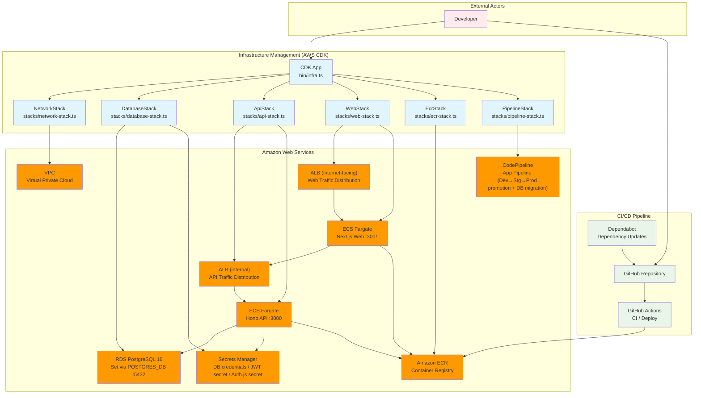
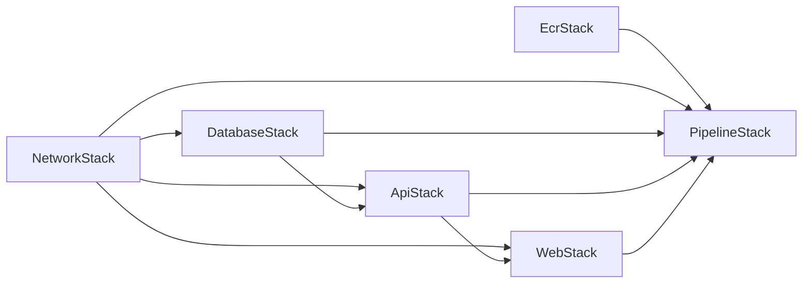
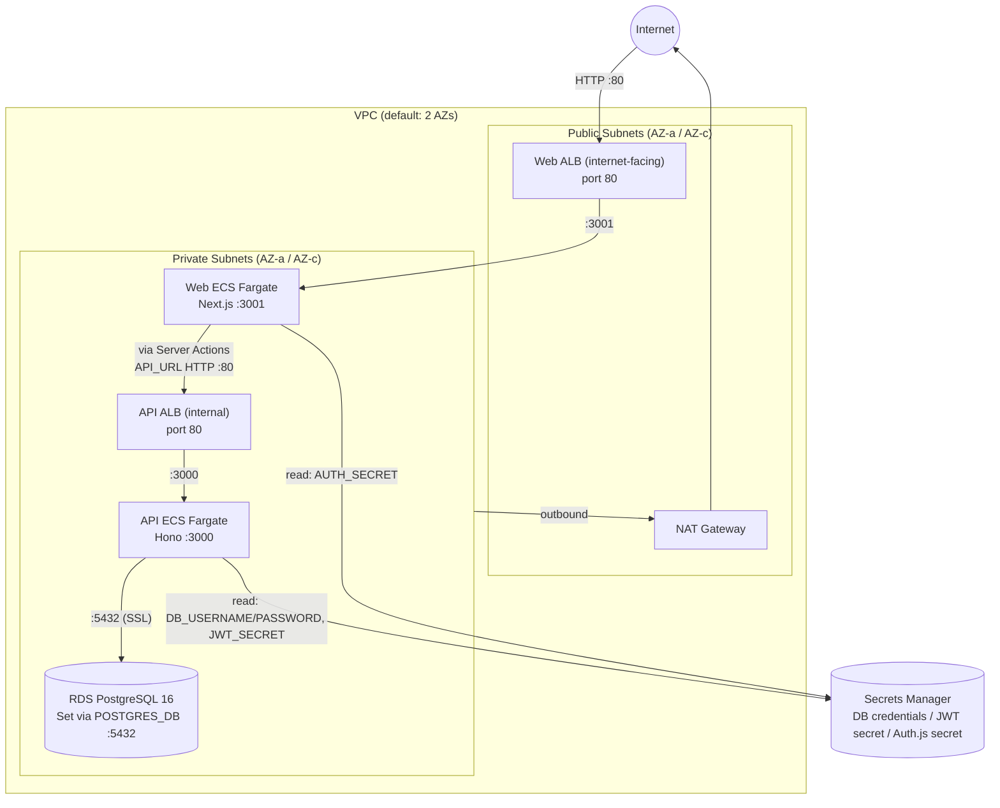
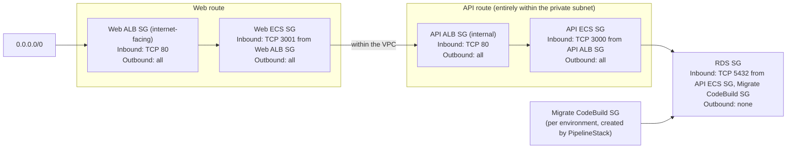
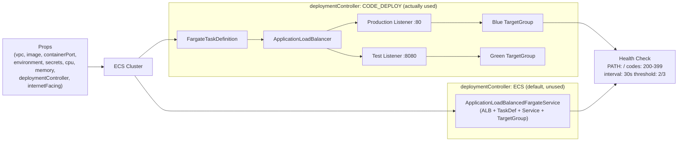

# Infrastructure Architecture

Defined with AWS CDK (TypeScript). DEV, STG, and PROD are each deployed to **separate AWS accounts**. DEV is always created; STG and PROD are only created if the `STG_ACCOUNT_ID` / `PROD_ACCOUNT_ID` environment variables are set.

## Account layout

- The CI/CD pipeline (`PipelineStack`) and ECR live together in the same "**Pipeline account**." By default (`PIPELINE_ACCOUNT_ID` unset), this **coincides with the DEV account** and needs no extra setup. Setting `PIPELINE_ACCOUNT_ID` to an account ID different from DEV splits it out into a dedicated Tooling/CI-CD account (this aligns more closely with AWS's standard multi-account layout, at the cost of one extra account).
- `cdk synth`/`cdk deploy` always run with the Pipeline account's credentials. If `PIPELINE_ACCOUNT_ID` is unset, the Pipeline account ID falls back to `CDK_DEFAULT_ACCOUNT` (auto-set by the CDK CLI from the credentials — i.e. the DEV account).
- Deploys to STG/PROD, and to DEV when `PIPELINE_ACCOUNT_ID` splits the Pipeline into a different account from DEV, are **cross-account deploys** from the Pipeline account. The resources needed to execute those deploys (the CodeDeploy DeploymentGroup, the CodeBuild project for Prisma migrations) are created in each account as a `DeployTargetStack`, and the Pipeline account's `PipelineStack` operates by assuming the IAM role it exposes.
- ECR is **consolidated in the Pipeline account** (holding the repositories for DEV/STG/PROD all together). Pulls from accounts other than the Pipeline account are allowed via the repository's resource policy (`AccountPrincipal`).
- Since CloudFormation can't do cross-account references across stacks, any reference to a resource in an account other than the Pipeline account is done by reverse-deriving the account ID and resource name from the naming convention in `lib/pipeline-naming.ts` and importing it with an `fromXxxAttributes`-style method.
- To actually deploy to an account different from the Pipeline account, you first need to run `cdk bootstrap aws://<ACCOUNT_ID>/<REGION> --trust <Pipeline account's own ID>` in that account to set up trust from the Pipeline account (see [deploy.md](./deploy.md) for details).

## System overview



---

## Stack dependencies



`PipelineStack` (in the Pipeline account) depends on `NetworkStack` (vpc, rdsSecurityGroup) and `DatabaseStack` (RDS instance, credentials) for environments that share the same account as the Pipeline (by default, only DEV) — needed to place the TargetGroup/Listener for Blue/Green deploys (from ApiStack/WebStack) and the CodeBuild project for Prisma migrations. For environments in a different account from the Pipeline (STG/PROD, and DEV when `PIPELINE_ACCOUNT_ID` is set), live CDK references within the same account aren't available, so `DeployTargetStack` (in each environment's account) depends on these instead, and the `PipelineStack` side just imports the resulting ARN/name reverse-derived from the naming convention.

| Stack | File | Account | Role |
|---|---|---|---|
| `EcrStack` | `lib/stacks/ecr-stack.ts` | Pipeline (co-located with DEV by default) | ECR repositories (api / web × environment, consolidated in the Pipeline account) |
| `PipelineStack` | `lib/stacks/pipeline-stack.ts` | Pipeline (co-located with DEV by default) | OIDC role for GitHub Actions + the app CodePipeline (Blue/Green deploy, DB migration; cross-account for environments in a different account from the Pipeline) |
| `NetworkStack` | `lib/stacks/network-stack.ts` | Per environment (DEV/STG/PROD) | VPC, subnets, security groups |
| `DatabaseStack` | `lib/stacks/database-stack.ts` | Per environment (DEV/STG/PROD) | RDS PostgreSQL, DB credentials |
| `ApiStack` | `lib/stacks/api-stack.ts` | Per environment (DEV/STG/PROD) | Hono API server (ECS Fargate, internal ALB) |
| `WebStack` | `lib/stacks/web-stack.ts` | Per environment (DEV/STG/PROD) | Next.js frontend (ECS Fargate, public ALB) |
| `DeployTargetStack` | `lib/stacks/deploy-target-stack.ts` | Environments in a different account from the Pipeline (STG/PROD, and DEV when `PIPELINE_ACCOUNT_ID` is set) | CodeDeploy DeploymentGroup, CodeBuild project for Prisma migrations, and the cross-account IAM role assumed by the Pipeline account |

---

## Overall architecture diagram



The browser always talks only to the Web ALB (a BFF setup using Next.js Server Actions plus Hono's typed RPC client). The API ALB is an internal ALB unreachable directly from the browser, and is accessed only from the Web tasks.

---

## Security groups

The ALB/ECS security groups are auto-generated by the `EcsFargateService` construct (when `internetFacing: false`, the API ALB sits in a private subnet and is unreachable from the internet).
The RDS security group is defined in `NetworkStack`, and `ApiStack` adds an inbound rule from the API ECS SG using `CfnSecurityGroupIngress`. In addition, `PipelineStack` adds an inbound rule from the Prisma-migration CodeBuild (a dedicated SG per environment) the same way.



---

## Stack details

### EcrStack

A stack in the Pipeline account (co-located with DEV by default) that manages an api/web ECR repository pair per environment. DEV is always created; STG/PROD are only created when the corresponding account ID is set.

| Item | Value |
|---|---|
| Repository name | `forge-ts/api-{env}` / `forge-ts/web-{env}` |
| Image scanning | Runs automatically on push (`imageScanOnPush: true`) |
| Lifecycle rule | Keeps only the most recent 20 images |
| Removal policy | `RETAIN` (the repository survives stack deletion) |

| Environment | Creation condition |
|---|---|
| DEV | Always |
| STG | Only if the `STG_ACCOUNT_ID` environment variable is set |
| PROD | Only if the `PROD_ACCOUNT_ID` environment variable is set |

The DEV repository (only when `PIPELINE_ACCOUNT_ID` splits the Pipeline into a different account from DEV) and the STG/PROD repositories automatically get a resource policy allowing pulls (e.g. `ecr:BatchGetImage`) from the corresponding account (`AccountPrincipal`). Since each account's ECS task execution role already has the IAM permission (`AmazonECSTaskExecutionRolePolicy`), this alone is enough to enable a cross-account pull.

### PipelineStack

A stack in the Pipeline account (co-located with DEV by default). It has two main roles.

1. **OIDC roles for GitHub Actions** (IAM only, unrelated to CodePipeline)
   | Role | Purpose | Scope |
   |---|---|---|
   | `github-actions-app-deploy` | Only for pushing images to the DEV ECR | `refs/heads/main` |
   | `github-actions-infra-deploy` | For `cdk deploy` (requires `main` Environment approval). In addition to the Pipeline account's own `cdk-*` bootstrap roles, if DEV (when `PIPELINE_ACCOUNT_ID` is set)/`STG_ACCOUNT_ID`/`PROD_ACCOUNT_ID` are set, their respective `cdk-*` roles are included as AssumeRole targets too | GitHub Environment `main` |

2. **App CodePipeline** (`ApiAppPipeline` / `WebAppPipeline`)
   - **Source**: not GitHub — triggered by detecting a `:latest` image push to the DEV ECR repository (within the Pipeline account) via EventBridge (`EcrSourceAction`). Since ECR is always consolidated in the Pipeline account, this stage itself always completes within the Pipeline account, even when DEV is in a different account
   - Stages run in the order **Generate → (Migrate) → Deploy**. The `Migrate*` stages (`MigrateDev`/`MigrateStg`/`MigrateProd`) exist only in `ApiAppPipeline`, running `prisma migrate deploy` on a CodeBuild project placed inside the VPC before proceeding to the Blue/Green deploy
   - The `Generate*` stage swaps out only the container image, starting from the **task-definition family name that's kept up to date on every `cdk deploy`** (fetching the latest ACTIVE revision, omitting the revision number — e.g. `stg-api`) rather than the task definition the ECS service is currently using (because an ECS service with the `CODE_DEPLOY` controller doesn't pick up task-definition updates via CloudFormation alone). If the target environment is in a different account from the Pipeline, the buildspec assumes the cross-account role via `sts assume-role` before calling `ecs describe-task-definition`
   - Promotion from DEV→STG→PROD is a copy of the ECR image digest, not a rebuild (`buildPromoteProject`; since ECR is always consolidated in the Pipeline account, this always completes within the same account). The approval gates are `ApproveStg`/`ApproveProd` (`ManualApprovalAction`)
   - For `Migrate*`/`Deploy*` actions whose target environment is in a different account from the Pipeline (STG/PROD, and DEV when `PIPELINE_ACCOUNT_ID` is set), execution is cross-account by passing the `pipeline-cross-account-{dev|stg|prod}` role exposed by `DeployTargetStack` (each environment's account) as the `role` prop (CodePipeline's native cross-account action mechanism). If any environment is in a different account from the Pipeline, the artifact S3 bucket uses a customer-managed KMS key via `crossAccountKeys: true`, and grants this role read/decrypt permissions

### DeployTargetStack

A stack created in each of the `STG_ACCOUNT_ID` / `PROD_ACCOUNT_ID` accounts (and DEV, when `PIPELINE_ACCOUNT_ID` splits the Pipeline into a different account from DEV), only when applicable. Since the pipeline in the Pipeline account can't make CloudFormation cross-account references into the target environment's account, the resources needed to execute the deploy are provisioned locally in that account and exposed under the name/ARN that can be reverse-derived from the naming convention in `lib/pipeline-naming.ts`.

| Resource | Purpose |
|---|---|
| CodeDeploy Application/DeploymentGroup (Api/Web) | The target for Blue/Green deploys. Has a fixed name following the naming convention, like `ApiStg`/`ApiStgDeploymentGroup` |
| CodeBuild project for Prisma migrations (Api/Web) | Placed in the same VPC as the RDS instance (a CodeBuild project in the Pipeline account can't reach across accounts into the VPC) |
| `pipeline-cross-account-{env}` IAM role | Assumable only by the Pipeline account (`AccountPrincipal`). Holds permissions for CodeDeploy operations, starting CodeBuild, and referencing ECS task definitions |

The permission to pull ECR images is granted by the resource policy on the ECR repository side (`EcrStack`), consolidated in the Pipeline account, so this stack needs no additional ECR configuration (only the IAM-side `ecr:BatchGetImage` etc. permissions are granted).

### NetworkStack

- **VPC**: public/private subnets in each AZ, 1 NAT Gateway
- Defines 3 security groups and passes them down to the lower stacks
- **VPC endpoints**: the S3 endpoint (Gateway type, all environments) is always created. The ECR (API/Docker), Secrets Manager, and CloudWatch Logs endpoints (Interface type) are only created when `enableVpcEndpoints` is `true`. `bin/infra.ts` sets this to `false` for DEV and `true` for STG/PROD (DEV, where traffic over the NAT Gateway is fine, prioritizes cost; STG/PROD restrict traffic to within AWS), and it cannot be overridden via an environment variable

| Security group | Inbound | Outbound |
|---|---|---|
| `albSecurityGroup` | TCP 80, 443 (0.0.0.0/0) | all |
| `ecsSecurityGroup` | TCP 3000 from ALB SG | all |
| `rdsSecurityGroup` | TCP 5432 from ECS SG | none |

> `albSecurityGroup` / `ecsSecurityGroup` are currently only defined in NetworkStack and aren't actually applied to any stack's ECS service (when the `EcsFargateService` construct uses `deploymentController: CODE_DEPLOY`, it manually builds the ALB/service and auto-generates its own SGs). `rdsSecurityGroup` is passed to DatabaseStack, ApiStack, and PipelineStack (for the migration CodeBuild) and is actually used.

### DatabaseStack

- Places RDS PostgreSQL 16 in the private subnet
- DB credentials are automatically stored in Secrets Manager (`DatabaseSecret`)
- Applies `rdsSecurityGroup` to the RDS instance

| Item | Value |
|---|---|
| DB name | Set via the `POSTGRES_DB` environment variable (required, no default) |
| User | `postgres` |
| Storage | 20 GB (auto-scales up to 100 GB) |
| Multi-AZ | Disabled |

### ApiStack

- Builds ALB + Fargate using the `EcsFargateService` construct (`lib/constructs/ecs-fargate-service.ts`) (a Blue/Green setup, since `deploymentController: CODE_DEPLOY`; see [Reusable construct](#reusable-construct-ecsfargateservice) for details)
- `internetFacing` defaults to `false` (internal ALB). The browser never accesses the API directly — it's only called from the Web app's server side (Server Actions)
- Injects RDS connection info and the JWT secret from Secrets Manager at startup
- Prisma (`@prisma/adapter-pg`) enables `ssl: { rejectUnauthorized: false }` only when `NODE_ENV=production`, to match RDS's encrypted-connection requirement
- Adds an inbound rule from the API ECS SG → RDS SG (:5432) via `CfnSecurityGroupIngress`
- Grants the task role `secretsmanager:GetSecretValue` for the DB credentials and JWT secret
- A global `app.onError()` logs uncaught exceptions before returning a 500 (since Hono's default behavior swallows exceptions)

```
Environment variables: DB_HOST, DB_PORT, DB_NAME, NODE_ENV
Secrets: DB_USERNAME, DB_PASSWORD (DatabaseSecret), JWT_SECRET (jwt-secret)
```

### WebStack

- Builds ALB + Fargate using the `EcsFargateService` construct (`internetFacing` defaults to `true` — the only entry point from the browser)
- Passes ApiStack's ALB DNS name as `API_URL` (resolved dynamically at deploy time). Next.js Server Actions (via Hono's typed RPC client `hc<AppType>()`) call the API at this URL from the server side. The browser always talks only to Web and never accesses the API directly
- Passes its own (WebService's) ALB DNS name as `AUTH_URL` (set explicitly to avoid a problem where Auth.js's `trustHost` Host-header inference would otherwise pick up the ECS task's internal hostname)
- Injects `AUTH_SECRET` as a secret from Secrets Manager (used by Auth.js to encrypt the session)

```
Environment variables: API_URL (http://<API ALB DNS>), AUTH_URL (http://<Web ALB DNS>), NODE_ENV
Secrets: AUTH_SECRET (Secrets Manager: {env}/auth-secret)
```

---

## Reusable construct: EcsFargateService

`lib/constructs/ecs-fargate-service.ts` — an ALB + ECS Fargate construct shared by ApiStack and WebStack. Which path it builds depends on the value of `deploymentController`. Since `bin/infra.ts` always specifies `CODE_DEPLOY` for both ApiStack and WebStack, **what's actually deployed is always the Blue/Green (CodeDeploy) path**, and the `ECS` (default) path's `ApplicationLoadBalancedFargateService` is currently unused.



On the Blue/Green side, `PipelineStack`'s `CodeDeployEcsDeployAction` gradually shifts production traffic (the Production Listener) over to Green, using the Test Listener (:8080) to pre-verify the new tasks.

---

## Configuration parameters

### Account-related

| Environment variable | Default | Description |
|---|---|---|
| `CDK_DEFAULT_ACCOUNT` | none | The DEV account's ID. Auto-set by the CDK CLI from the credentials used to run cdk, so no explicit value is needed |
| `CDK_DEFAULT_REGION` | none | The region shared by all accounts. Required when `STG_ACCOUNT_ID`/`PROD_ACCOUNT_ID`/`PIPELINE_ACCOUNT_ID` (if different from DEV) is set (if unset, `cdk synth`/`deploy` fails with an error) |
| `PIPELINE_ACCOUNT_ID` | `CDK_DEFAULT_ACCOUNT` (i.e. co-located with DEV) | The ID of the account where the Pipeline (`PipelineStack`/`EcrStack`) is placed. DEV is only treated as a cross-account target (`DevDeployTargetStack`) when a value different from DEV is set |
| `STG_ACCOUNT_ID` | none | The STG account's ID. STG-related stacks (`StgNetworkStack` etc./`StgDeployTargetStack`) are only created when this is set |
| `PROD_ACCOUNT_ID` | none | The PROD account's ID. PROD-related stacks are only created when this is set |

### Per-environment resource configuration

Read by `createEnvInfra()` in `bin/infra.ts`. Most are environment variables prefixed per environment with `DEV_` / `STG_` / `PROD_` (`${E}_XXX`), individually overridable per environment. `POSTGRES_DB` is the only unprefixed, shared variable, and it's required (if unset, `cdk synth`/`deploy` fails with an error).

| Environment variable | Default | Description |
|---|---|---|
| `POSTGRES_DB` | none (required) | RDS database name. A single variable shared across all environments (no per-environment prefix) |
| `{ENV}_MAX_AZS` | `2` | Number of AZs for NetworkStack |
| `{ENV}_DB_INSTANCE_TYPE` | `t3.micro` | RDS instance type |
| `{ENV}_DB_ALLOCATED_STORAGE` | `20` | Initial storage (GB) |
| `{ENV}_DB_MAX_ALLOCATED_STORAGE` | `100` | Auto-scaling upper bound (GB) |
| `{ENV}_API_CPU` | `256` | CPU units for the API task |
| `{ENV}_API_MEMORY_MIB` | `512` | Memory (MiB) for the API task |
| `{ENV}_API_DESIRED_COUNT` | `1` | Number of API task instances |
| `{ENV}_WEB_CPU` | `256` | CPU units for the Web task |
| `{ENV}_WEB_MEMORY_MIB` | `512` | Memory (MiB) for the Web task |
| `{ENV}_WEB_DESIRED_COUNT` | `1` | Number of Web task instances |

`{ENV}` is `DEV` / `STG` / `PROD` (e.g. `DEV_API_CPU`, `STG_DB_INSTANCE_TYPE`). These only take effect for environments whose `STG_ACCOUNT_ID`/`PROD_ACCOUNT_ID` is set.
